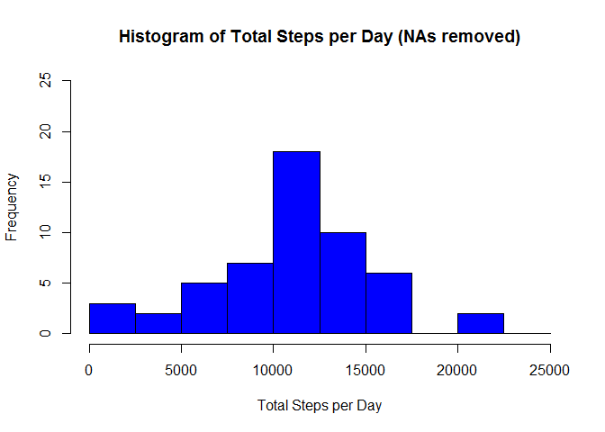
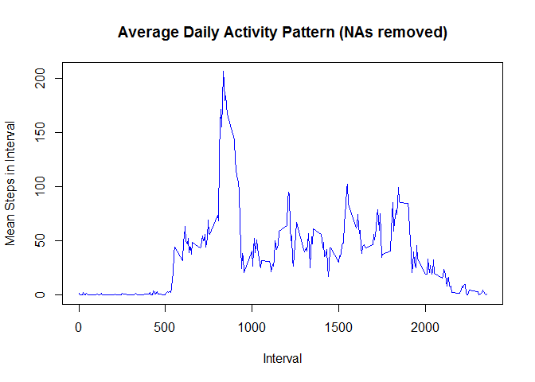
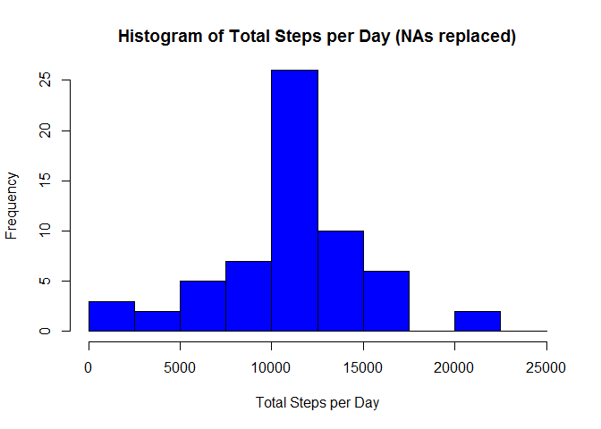
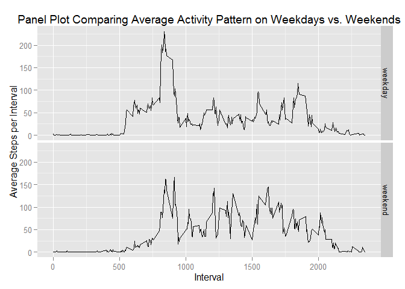

# Reproducible Research: Peer Assessment 1


```r
library(knitr)
```

```
## Warning: package 'knitr' was built under R version 3.2.3
```

```r
opts_chunk$set(echo = TRUE)
```


## Loading and preprocessing the data


```r
unzip("activity.zip")
rawdata <- read.csv("activity.csv", colClasses = c("integer", "Date", "integer"))
```

## What is mean total number of steps taken per day?

### 1. Make a histogram of the total number of steps taken each day


```r
library(dplyr)
```

```
## 
## Attaching package: 'dplyr'
## 
## The following objects are masked from 'package:stats':
## 
##     filter, lag
## 
## The following objects are masked from 'package:base':
## 
##     intersect, setdiff, setequal, union
```

```r
daily.steps <- rawdata %>%
  filter(!is.na(steps)) %>%
  group_by(date) %>%
  summarise(dailysteps = sum(steps))

hist(x = daily.steps$dailysteps,
     breaks = seq(from = 0, to = 25000, by = 2500),
     col = "blue",
     xlab = "Total Steps per Day",
     ylim = c(0, 25),
     main = "Histogram of Total Steps per Day (NAs removed)")
```

 

### 2. Calculate and report the mean and median total number of steps taken per day


```r
mean(daily.steps$dailysteps)
```

```
## [1] 10766.19
```

```r
median(daily.steps$dailysteps)
```

```
## [1] 10765
```


## What is the average daily activity pattern?

### 1. Make a time series plot (i.e. type = "l") of the 5-minute interval (x-axis) and the average number of steps taken, averaged across all days (y-axis)


```r
interval.steps <- rawdata %>%
  filter(!is.na(steps)) %>%
  group_by(interval) %>%
  summarise(intervalsteps = mean(steps))

plot(interval.steps$interval, interval.steps$intervalsteps,
     type = "l",
     col = "blue",
     xlab = "Interval",
     ylab = "Mean Steps in Interval",
     main = "Average Daily Activity Pattern (NAs removed)")
```

 

### 2. Which 5-minute interval, on average across all the days in the dataset, contains the maximum number of steps?


```r
n <- which.max(interval.steps$intervalsteps)
as.numeric(interval.steps[n,1])
```

```
## [1] 835
```


## Imputing missing values

### 1. Calculate and report the total number of missing values in the dataset (i.e. the total number of rows with NAs)


```r
data <- rawdata
na_count <- sum(is.na(data))
na_count
```

```
## [1] 2304
```

### 2. Devise a strategy for filling in all of the missing values in the dataset. The strategy does not need to be sophisticated. For example, you could use the mean/median for that day, or the mean for that 5-minute interval, etc.
### 3. Create a new dataset that is equal to the original dataset but with the missing data filled in.


```r
nas <- is.na(data$steps)
intervalavg <- tapply(data$steps, data$interval, mean, na.rm = TRUE, simplify = TRUE)
data$steps[nas] <- intervalavg[as.character(data$interval[nas])]
head(data)
```

```
##       steps       date interval
## 1 1.7169811 2012-10-01        0
## 2 0.3396226 2012-10-01        5
## 3 0.1320755 2012-10-01       10
## 4 0.1509434 2012-10-01       15
## 5 0.0754717 2012-10-01       20
## 6 2.0943396 2012-10-01       25
```

Now check that NAs have been removed


```r
sum(is.na(data$steps))
```

```
## [1] 0
```

### 4. Make a histogram of the total number of steps taken each day and Calculate and report the mean and median total number of steps taken per day. Do these values differ from the estimates from the first part of the assignment? What is the impact of imputing missing data on the estimates of the total daily number of steps?


```r
q3daily.steps <- data %>%
  filter(!is.na(steps)) %>%
  group_by(date) %>%
  summarise(dailysteps = sum(steps))

hist(x = q3daily.steps$dailysteps,
     breaks = seq(from = 0, to = 25000, by = 2500),
     col = "blue",
     xlab = "Total Steps per Day",
     ylim = c(0, 25),
     main = "Histogram of Total Steps per Day (NAs replaced)")
```

 

```r
mean(q3daily.steps$dailysteps)
```

```
## [1] 10766.19
```

```r
median(q3daily.steps$dailysteps)
```

```
## [1] 10766.19
```

Because the NAs have been replaced by mean values for the corresponding interval across all days there has been no impact to the mean value.  The median value has been brought up by 1.19 steps to match the mean value.

## Are there differences in activity patterns between weekdays and weekends?
### For this part the weekdays() function may be of some help here. Use the dataset with the filled-in missing values for this part.

### 1. Create a new factor variable in the dataset with two levels -- "weekday" and "weekend" indicating whether a given date is a weekday or weekend day.


```r
q4data <- data
wkend <- c("Sat", "Sun")
q4data$wkday <- factor((weekdays(q4data$date, abbreviate = TRUE) %in% wkend), levels = c(FALSE, TRUE), labels = c("weekday", "weekend"))
```

### 2. Make a panel plot containing a time series plot (i.e. type = "l") of the 5-minute interval (x-axis) and the average number of steps taken, averaged across all weekday days or weekend days (y-axis).


```r
library(ggplot2)
q4steps <- q4data %>%
  filter(!is.na(steps)) %>%
  group_by(wkday, interval) %>%
  summarise(intervalsteps = mean(steps))
g <- ggplot(q4steps, aes(x = interval, y = intervalsteps))
g + geom_line() + facet_grid(wkday ~ .) +labs(x = "Interval", y = "Average Steps per Interval", title = "Panel Plot Comparing Average Activity Pattern on Weekdays vs. Weekends")
```

 

There appears to be a difference between activity patterns in that on weekdays there is a large amount of activity in the early morning (0700 to 0900) followed by several hours of relative inactivity.  On the weekends however, there is less activity in the morning but the activity is consistently higher throughout the day.
